# Earn It 钱贷网 软件设计文档
{:.no_toc}

* 目录
{:toc}

## 1、技术选型

- 此项目选择以Web开发来实现。因为我们提供的是一个方便的平台，使用Web端的话，学生和组织只需要在网页上打开、注册登录即可。并且Web开发可以前端交互与后端服务完全分离开发，能让我们像一个正式的团队项目一样进行分工、工作交接、项目管理等。

- 前端技术选用React + antd实现；其前端组件简洁美观，适合我们的项目。

- 后端技术选用nodejs的Express开发框架实现；其提供了一个合理且易于理解的目录结构，分层结构清晰明了。

- 数据库选用MongoDB；相比较于MySQL，其更加轻量，并且尽量得舍弃了数据间的关系；另外，MongoDB是面向文档的数据库，用BSON格式存储，可读性高。

## 2、架构设计

### 逻辑架构

逻辑架构分为以下三层：

- **表示层**： 用户（任务发布者和接受者）使用Web端作为表示层，提供任务列表的显示与筛选、任务管理系统、任务处理系统、用户管理系统、问卷填写系统。

- **业务层**： 后端服务器充当业务层，根据表示层的请求，完成各个子系统的不同服务模块，向整个系统项目提供不同的功能。

- **持久化层**： MongoDB数据库提供了数据的持久化服务。

- 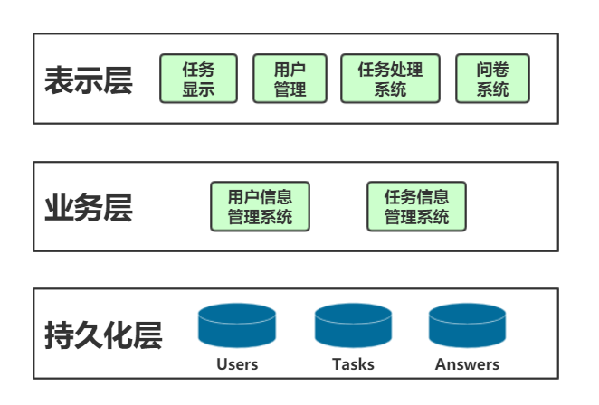

### 项目结构

- 表示层对应的是前端FrontEnd，其目录如下所示：
  
  ```
  .
  ├── public
  │   ├── favicon.ico
  │   ├── index.html
  │   └── manifest.json
  ├── src
  │   ├── apis
  │   │   ├── index.js
  │   │   ├── instance.js
  │   │   └── user.js    
  │   ├── components
  │   │   ├── AllTaskList.jsx
  │   │   ├── AnswerList.jsx
  │   │   ├── AppRouter.jsx
  │   │   ├── CheckAllBox.jsx
  │   │   ├── CreateSurvey.jsx
  │   │   ├── FillSurveyPage.jsx
  │   │   ├── HomePage.jsx
  │   │   ├── LoginForm.jsx
  │   │   ├── MyTaskList.jsx
  │   │   ├── NewTask.jsx
  │   │   ├── RegisterForm.jsx
  │   │   ├── SurveyAnswerContainer.jsx
  │   │   ├── SurveyWithAnswer.jsx
  │   │   ├── TaskBasicForm.jsx
  │   │   ├── TaskFilter.jsx
  │   │   ├── TaskInfo.jsx
  │   │   ├── TaskInfoList.jsx
  │   │   ├── TaskList.jsx
  │   │   └── TaskListContainer.jsx
  │   ├── context
  │   │   └── index.js
  │   ├── index.css
  │   └── index.jsx
  ├── .travis.yml
  ├── app.yaml
  ├── config-overrides.js
  ├── package-lock.json
  ├── package.json
  └── README.md
  ```

  前端源代码主要分为：
    - apis：与后端接口相关的代码
    - components：页面渲染和逻辑交互的组件
    - context：上下文处理相关的代码
    - index：App启动

- 业务层对应的是后端BackEnd，其目录如下所示：

  ```
  .
  ├── src
  │   ├── controller
  │   │   ├── task.js
  │   │   └── user.js    
  │   ├── model
  │   │   ├── answerList.js
  │   │   ├── global.js
  │   │   ├── task.js
  │   │   └── user.js
  │   ├── router
  │   │   ├── baseRouter.js
  │   │   ├── taskRouter.js
  │   │   └── userRouter.js
  │   ├── tests
  │   │   └── user.test.js
  │   ├── util
  │   │   ├── auth.js
  │   │   ├── auth.test.js
  │   │   └── logger.js
  │   ├── app.js
  │   ├── config.js
  │   └── server.js
  ├── .eslintrc
  ├── .prettierrc.json
  ├── .travis.yaml
  ├── jest.config.js
  ├── package.json
  └── README.md
  ```

  后端源代码主要分为：
    - controller：接收请求之后的处理逻辑代码
    - model：数据结构定义
    - router：网络请求路由代码
    - util：一些组件
    - app：App启动
    - config：全局配置文件
    - server：后端服务器启动
    - tests：开发测试用代码

## 3、模块划分

本项目主要分为以下两个模块：

### 1. 用户注册登录模块

  - 负责用户的注册、登录；在一个页面完成，其功能模型如下：

  - 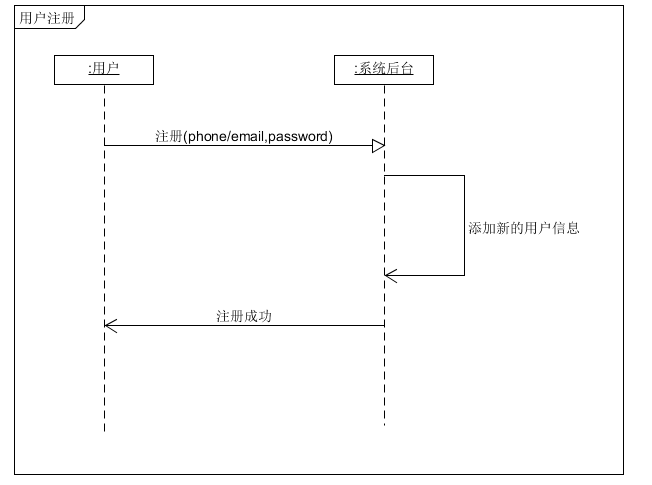

  - 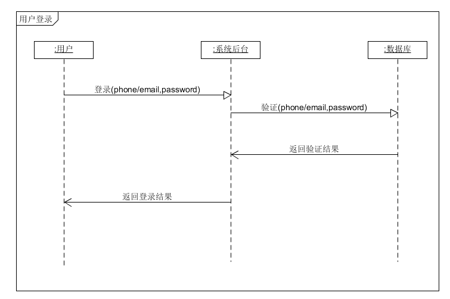

  - 另外，此模块还存储并管理用户信息数据。

### 2. 任务管理模块

  - 负责任务的发布、接收、管理；其功能模型如下：
  
  - 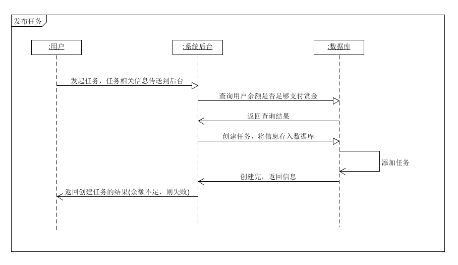

  - 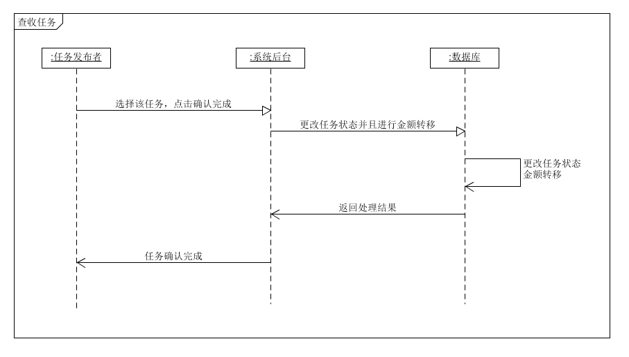

  - 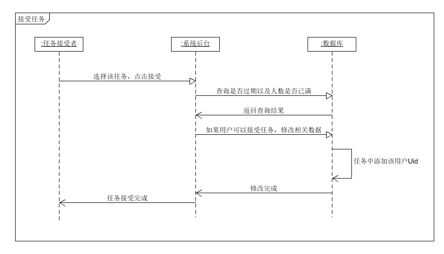

## 4、数据库设计

### 数据库ER图

- 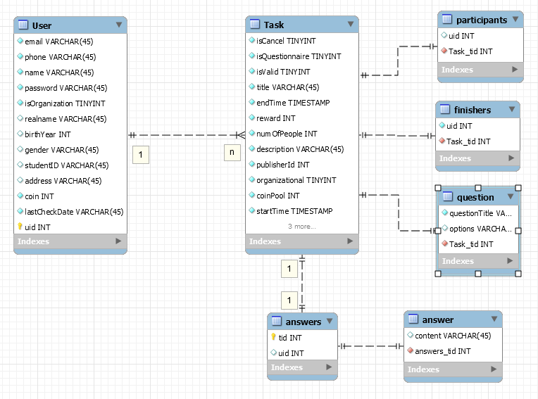

- 本项目使用MongoDB实现数据库，而MongoDB的特性之一为尽可能的去除关系，因此实际实现时，仅有3个表：User，Task和Answers。另外的几个作为对应数据的一个数组。

### User表

- User使用isOrganization来区分个人账号和组织账号，两种账号会有些数据不同

- **个人账号**
  - realname
  - birthYear
  - gender  (enum["male", "female", "other"])
  - studentID

- **组织账号**
  - address

### Task表

- 每个Task会记录发布人的ID，以及其它相关信息（如时间、任务描述等）；

- Task使用isQuestionnaire来区分普通任务和问卷调查，如果为问卷调查，则用question数组来存储问卷的问题内容。若为普通任务，则没有这个数组；

- 如果Question为选择题，则还会有options数组，存储选项内容；

- Task使用participants数组和finishers数组，来分别记录参与者uid和完成任务者uid。

### Answer表

- 每个Answer有一个tid，来表示其是属于哪个任务（问卷）的填写结果；

- 每个Answer有一个uid，为填写人的id；

- Answer的结构对应其问题Question。

## 5、软件设计技术

### 1. 中间件模式

  - 这是在Node.js中广泛使用的一种设计模式，将一个比较庞大而复杂的逻辑事件，分解为几个小事件。每个小事件作为一个插件，以函数形式连接在一起，形成一个异步队列，来完成对数据的预处理和后处理，这就是**中间件模式**。

  - 在后端代码中的多处被用到，如./model/user.js中的：
    ```javascript
    // 89~102

    // hash password for security reason
    userSchema.pre('save', async function(next) {
      const user = this
      if (user.isModified('password')) {
        try {
          const hash = await bcrypt.hash(user.password, 10)
          user.password = hash
          next()
        } catch (err) {
          next(err)
        }
      }
      next()
    })
    ```
    以上代码即使用了中间件，在user数据保存到数据库之前，插入一个中间件，对user的密码password进行加密。

### 2. 结构化编程 (Structure Programming)

  - **原则**： 自顶向下，逐步细化；清晰第一，效率第二；书写规范，缩进格式；基本结构，组合而成

  - 在具体实现项目的时候，首先确定整个框架的文件。以BackEnd为例，首先确定后端需要的总体代码框架：

    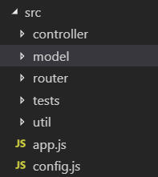

    然后根据上面第3大点的模块划分，确定要实现的具体文件，分别对应user和task：

    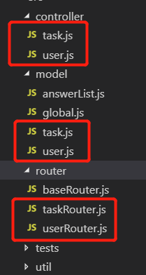

    确定了几个模块，协定好各个模块之间的功能和联系，然后就继续向下细化，根据API接口来定义内部函数，如user的：

    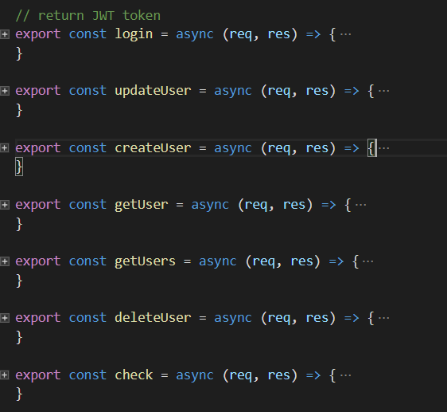

    最后在具体实现每个函数的细节即可。
  
  - 以上即为项目中用到的结构化编程技术，整个项目基本都对各个模块进行划分与结构化，这样可以减少代码之间的耦合，方便实现、调试与修改。

### 3. 面向对象编程 (Object-Oriented Programming)

  - OOP技术把对象作为程序的基本单元，一个对象包含数据和操作数据的函数。由于本项目的模块划分是根据两大数据模型User和Task来区分的，因此使用OOP对项目的实现有利。

  - 继续以BackEnd为例，对User这一对象进行说明，User定义的是平台用户对象，其在Model里定义了数据结构：

    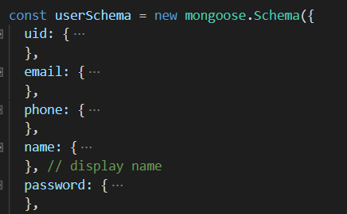

    以及这个对象会用到的一些方法method：

    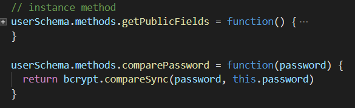

### 4. 设计模式 (Design Patterns)

  - MVC模式

  - Model为 ./BackEnd/src/model

    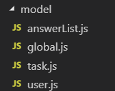

  - View为 ./FrontEnd

    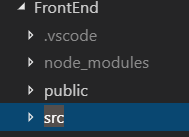
  
  - Controller为 ./BackEnd/src/controller

    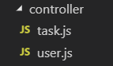

## 6、其它声明

  - 本项目与系统分析课程项目为同一项目，小组成员亦一致。
