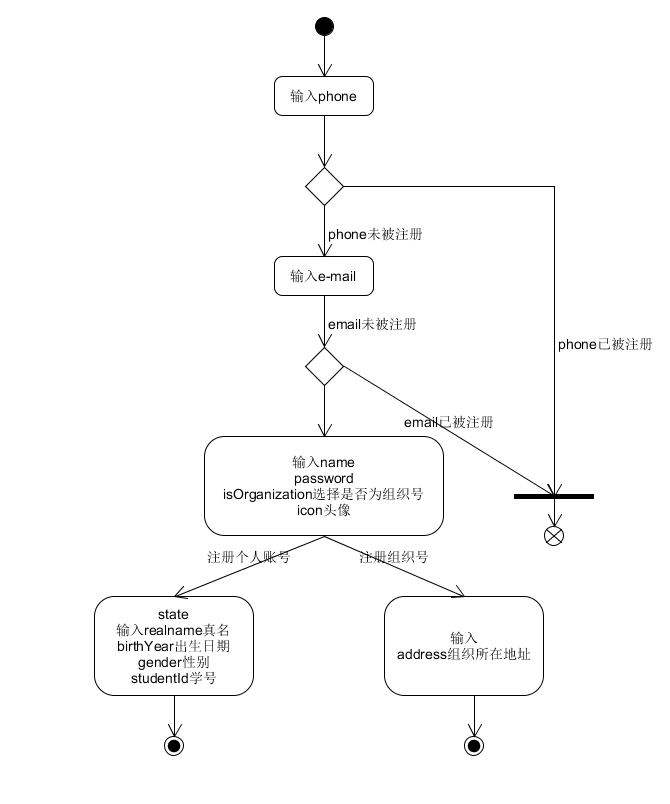
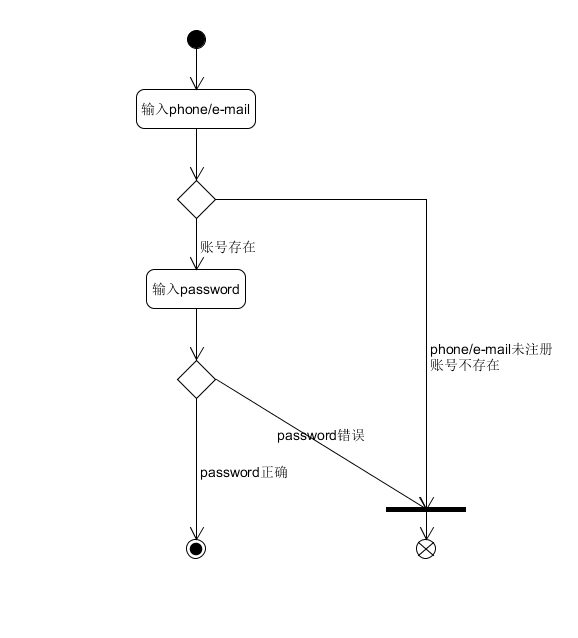
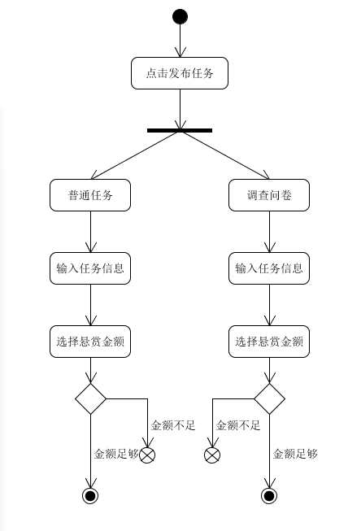
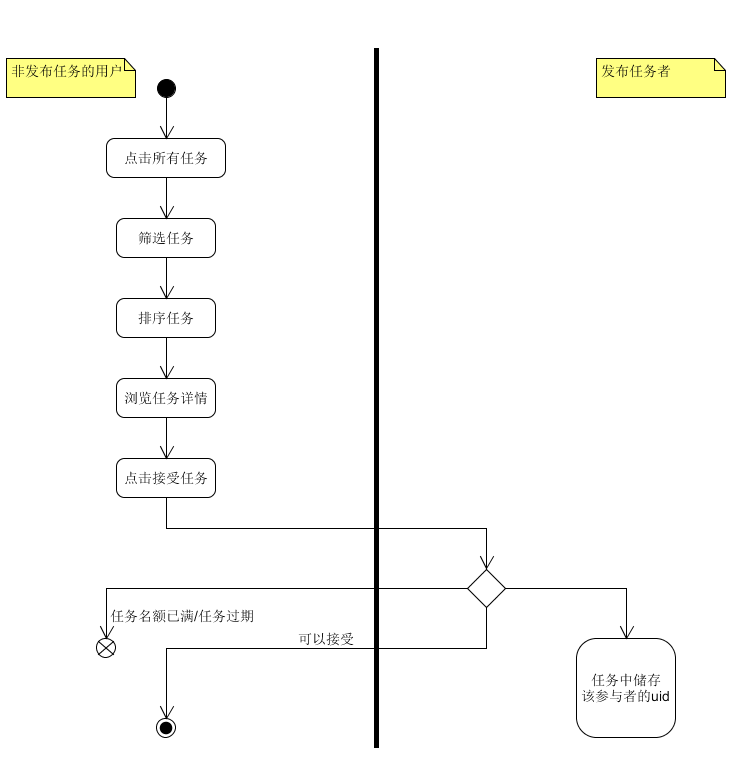
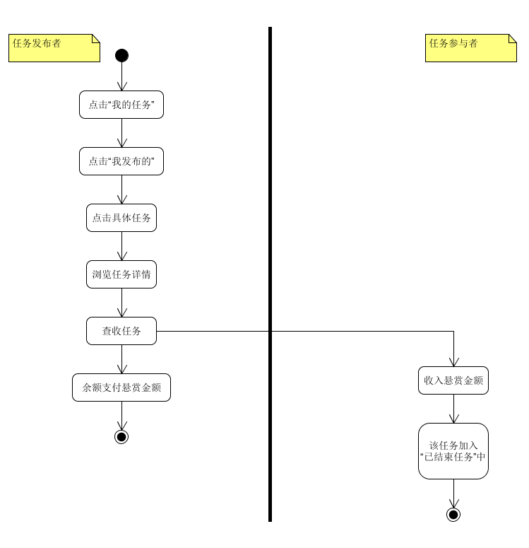

# Earn It 钱贷网 需求规格说明书
{:.no_toc}

## 1、项目概要

- **项目目标**是实现一个钱贷网平台，主要面向学生提供服务。学生可以在其上注册个人账号，提供悬赏金发布一些任务和调查问卷，让别人帮忙完成。要运行一些组织机构注册组织号，在其上招募学生帮忙做散工、科研等项目。

- **项目灵感**来源于偶尔在微信群上看到的一些问卷，基本是同学们在完成不同课程大作业时所需要做的项目调研。但是，受限于社交圈子，同学们很多时候可能没法收集足够的对应用户群的信息（例如想要调查女生们的日常化妆品购买情况，但苦于身边的圈子是游戏玩家）。因此，我们小组就想要实现一个平台，帮助同学们在其上广泛收集问卷调查信息。同时，光有问卷业务则太过贫乏，还可以加上最基本的悬赏任务，将自己不擅长的事交给别人去帮忙。此项目就是基于这样一个想法。

- **产品技术**：基于上面的想法，我们选择用Web开发来实现这个平台，用户只需要打开网址，注册账户即可在其上操作。

## 2、功能需求

- 平台提供用户注册与登录功能，用户分为**个人账户**和**组织账户**两种

- 用户可发布任务，任务分为**普通任务**和**问卷调查**两种

- 用户可接受任务：
  - 若接受普通任务（比如一个帮忙收快递的跑腿任务），则发布者会在任务详情提供联系方式，经过双方确认之后，由发布者来进行任务完成的确认
  - 若接受问卷调查，则参与人只需填完问卷提交即可完成

- 用户可查看、管理自己发布和参与的任务

- 用户登录后进入平台主界面，主界面要有任务列表，显示所有任务，并且提供筛选和排序

- 用户可以查看、管理、修改自己的用户信息

- 此项目仅为课程项目，未与金钱挂钩，因此提供一个用户签到功能，增加账户拥有的金币

## 3、用例建模

根据上面的需求，进行用例建模：

1. 用户注册

  

2. 用户登录

  

3. 发布任务

  

4. 浏览任务并接受任务

  

5. 确认并查收任务

  

## 4、完整程序用例图

  
